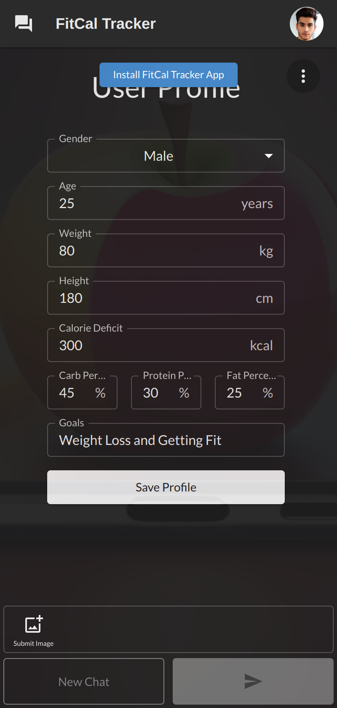
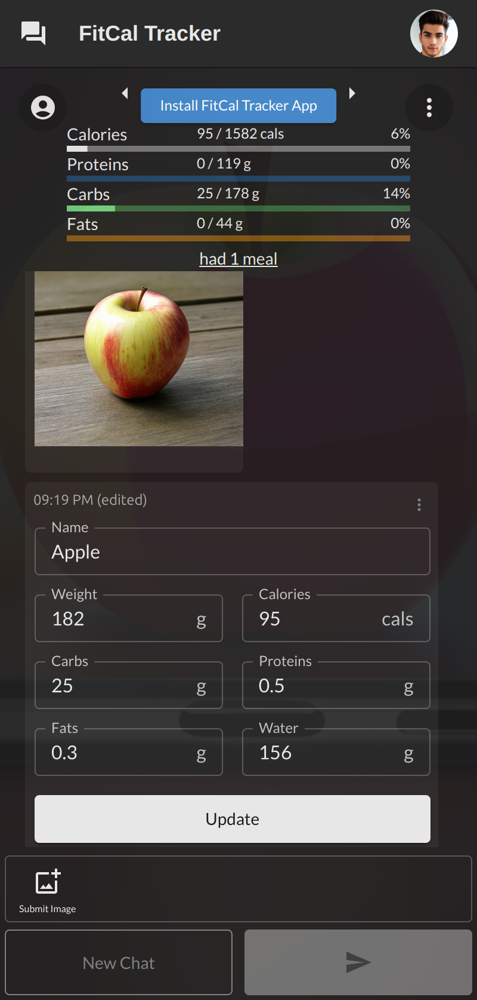
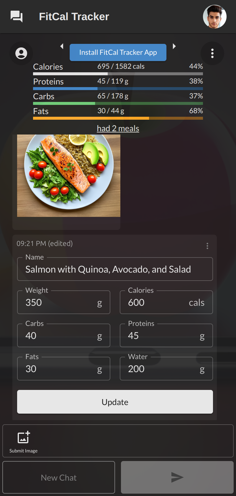
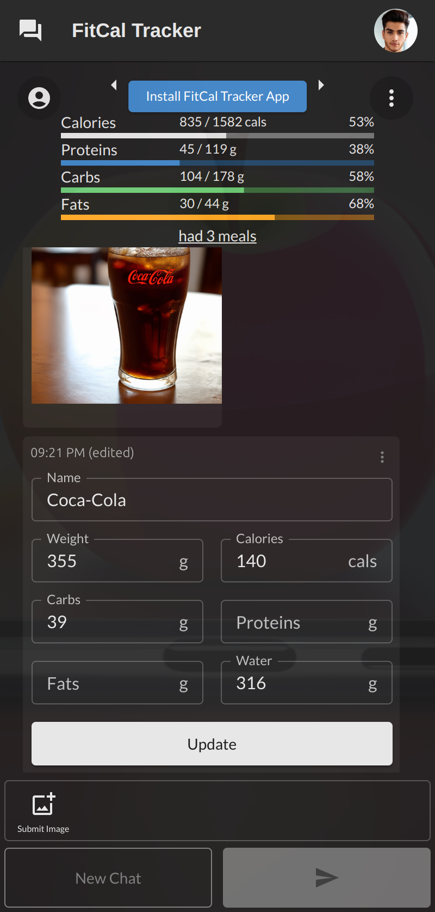
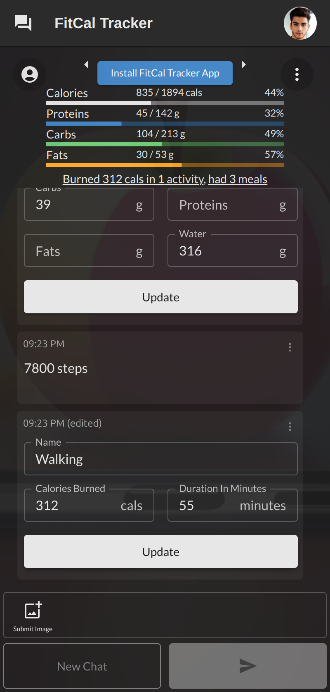
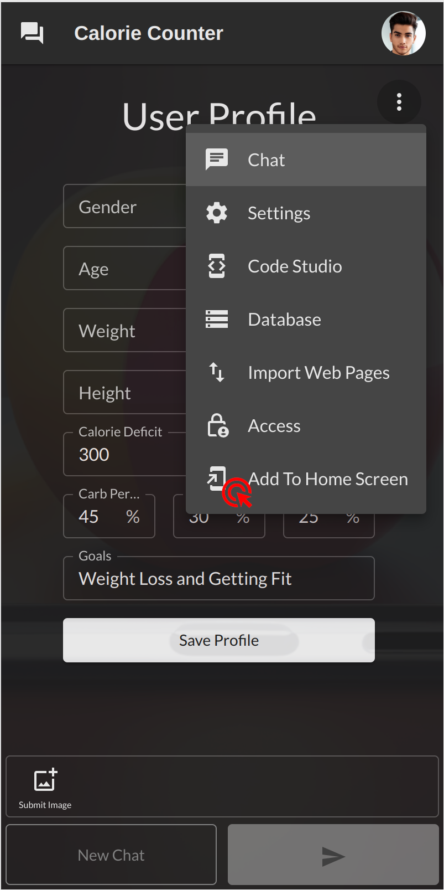

# AI Calorie Counter

<table>
  <tr>
    <td>
      
    </td>
    <td>
      <strong>An AI app to easily track calories and exercise by taking a photo of your meal or describing your physical activity</strong>
    </td>
  </tr>
</table>

<br />

<div style="display: flex; flex-direction: row;">
    
    
    
    
    
</div>

## Installation Guide

### Install from OpenKBS Cloud

To install the AI Calorie Counter app, visit [Install Calorie Counter](https://openkbs.com/apps/calorie-counter/) on your mobile phone. For quick access, add it to your Home Screen:

1. Open the link in your mobile browser.
2. Select "Add to Home screen" from the browser menu.

This will place the app on your home screen for easy access.
### Install with CLI

To install the AI Calorie Counter app via the command line interface (CLI), follow these steps:

#### Step 1: Install OpenKBS CLI

You need to have the OpenKBS CLI installed on your system. You can install it using one of the following methods:

- **Option 1: Install via npm**
  ```bash
  npm install -g openkbs
  ```

- **Option 2: Download Binary**

    - **Linux:**
      ```bash
      wget -O ~/Downloads/openkbs https://downloads.openkbs.com/cli/linux/openkbs && chmod +x ~/Downloads/openkbs && sudo mv ~/Downloads/openkbs /usr/local/bin/openkbs
      ```

    - **Mac:**
      ```bash
      curl -o ~/Downloads/openkbs https://downloads.openkbs.com/cli/macos/openkbs && mkdir -p /usr/local/bin && chmod +x ~/Downloads/openkbs && sudo mv ~/Downloads/openkbs /usr/local/bin/openkbs
      ```

    - **Windows:**
      ```powershell
      Invoke-WebRequest -Uri "https://downloads.openkbs.com/cli/windows/openkbs.exe" -OutFile "$Env:USERPROFILE\Downloads\openkbs.exe"
      $Env:Path += ";$Env:USERPROFILE\Downloads"
      ```

#### Step 2: Clone the Repository

Clone the repository to your local machine:

```bash
git clone git@github.com:open-kbs/ai-calorie-counter.git
cd ai-calorie-counter
```

#### Step 3: Deploy the Application to the Cloud

Deploy your application using the OpenKBS CLI:

```bash
openkbs push
```

Once the deployment is complete, you will receive a URL for your app: `https://{kbId}.apps.openkbs.com`.

### Installing the App on Your Mobile Device

Install the AI Calorie Counter as a Progressive Web App (PWA) for easy access:

1. Log in to [OpenKBS](https://openkbs.com): Use your mobile browser.
2. Go to "My Apps": Find the AI Calorie Counter.
3. Open the App: Click to launch it.
4. Add to Home Screen: Select "Add to Home screen" from the Mobile menu.

This will place the app on your home screen for quick access.

> **Note:** To activate the "Add to Home screen" button, you may need to interact with the page at least once to meet user engagement heuristics.
<div>
    
</div>

Congratulations! You now have the AI Calorie Counter app installed on your phone. Enjoy tracking your calories and exercise effortlessly!